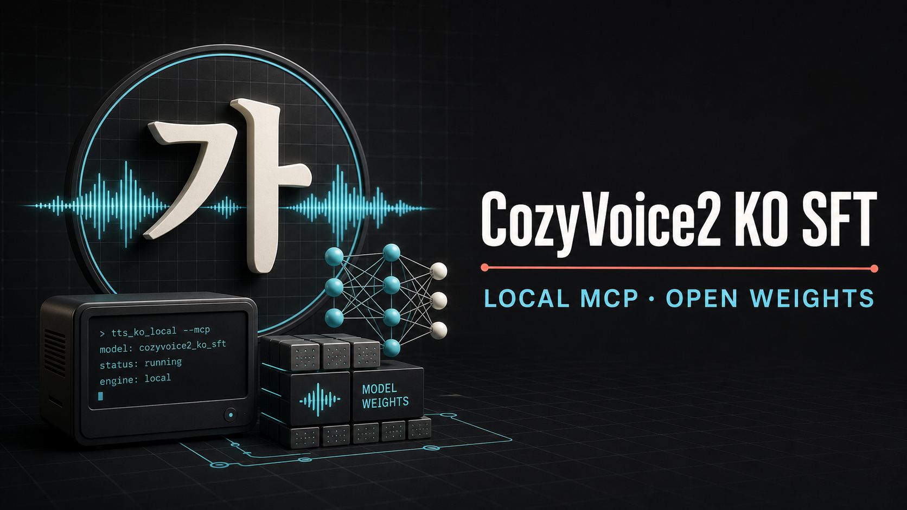

# CosyVoice2 Korean SFT + Local MCP



한국어 억양과 발화 스타일을 강화한 CosyVoice2 community SFT 모델을 Claude와
Codex에서 직접 호출할 수 있게 만든 로컬 MCP 배포판입니다. 음성 합성은 사용자의
PC에서 실행되며 중앙 추론 서버를 사용하지 않습니다.

> Community project. Not an official FunAudioLLM, Alibaba, NIA, Anthropic, or OpenAI release.

## Why Local

- **Privacy by default**: 합성 문장과 reference audio를 외부 TTS API로 전송하지 않습니다.
- **Korean prosody**: 한국어 감정·발화 스타일 데이터로 SFT한 Epoch 3 LLM 가중치를 사용합니다.
- **Accessible hardware**: 0.5B급 LLM 코어 기반으로 12GB VRAM급 GPU를 목표로 합니다.
  RTX 3060 12GB에서 사용할 수 있고 RTX 5060 Ti 16GB에서는 더 여유 있게 동작합니다.
- **Unlimited local retries**: 모델을 한 번 내려받으면 호출당 과금이나 API rate limit 없이
  결과가 마음에 들 때까지 로컬에서 다시 생성할 수 있습니다.
- **Agent-ready**: Claude Code, Claude Desktop, Codex가 공통 MCP 도구로 음성을 생성합니다.
- **Offline after setup**: 모델 cache가 준비되면 `HF_HUB_OFFLINE=1`로 추론할 수 있습니다.

여기서 0.5B는 CosyVoice2의 언어모델 코어 규모를 뜻합니다. 전체 TTS 구성에는 flow,
vocoder, tokenizer 및 ONNX 구성요소가 추가로 포함됩니다.

## Verified Hardware

| GPU | Runtime | Result |
|---|---|---|
| RTX 5060 Ti 16GB | PyTorch 2.8.0, CUDA 12.8, FP16 | 7.04s WAV, RTF 1.31, peak allocated 3.38GiB, peak reserved 4.06GiB |
| RTX 3090 24GB | PyTorch 2.3.1, CUDA 12.1 | 7.76s WAV, RTF 1.07 |
| RTX 3060 12GB | Same 12GB-class local target | Supported with substantial memory headroom from the 5060 Ti measurement |

The RTX 3060 line is a supported hardware target based on the measured inference peak; exact RTF
depends on driver and PyTorch build. The installer defaults to PyTorch 2.8/CUDA 12.8 so both Ampere
and Blackwell GPUs are covered.

## Release Layout

- Source and MCP: this GitHub repository
- Fine-tuned LLM weights: `feedingstick321-maker/CosyVoice2-KO-SFT-v6-epoch3`
- Base components: `FunAudioLLM/CosyVoice2-0.5B`
- Selected checkpoint: SFT v6 Epoch 3

The installer downloads the pinned base model and overlays only the Korean fine-tuned LLM.
The AI Hub training corpus, derived parquet files, embeddings, tokens, and production audio are
not distributed.

## Quick Start on Windows

Requirements: NVIDIA GPU with at least 12GB VRAM, current NVIDIA driver, Git, and `uv`.

```powershell
git clone --recursive https://github.com/feedingstick321-maker/cosyvoice2-ko-sft-mcp.git
cd cosyvoice2-ko-sft-mcp
powershell -ExecutionPolicy Bypass -File .\scripts\install.ps1
.\.venv\Scripts\cosyvoice-ko-prepare.exe
```

The default model cache is `%LOCALAPPDATA%\CosyVoice2-KO-MCP`.

## Attach to Codex

```powershell
codex mcp add cosyvoice-ko -- `
  "$PWD\.venv\Scripts\cosyvoice-ko-mcp.exe"
```

Equivalent `~/.codex/config.toml`:

```toml
[mcp_servers.cosyvoice_ko]
command = "C:\\path\\to\\cosyvoice2-ko-sft-mcp\\.venv\\Scripts\\cosyvoice-ko-mcp.exe"
startup_timeout_sec = 120
```

## Attach to Claude Code

```powershell
claude mcp add --transport stdio --scope user cosyvoice-ko -- `
  "$PWD\.venv\Scripts\cosyvoice-ko-mcp.exe"
```

For Claude Desktop, use the same executable as a `stdio` MCP server in
`claude_desktop_config.json`.

## MCP Tools

| Tool | Purpose |
|---|---|
| `model_status` | Check model cache, GPU, CUDA, VRAM, and revisions |
| `usage_reporting_status` | Check optional usage-reporting consent and endpoint state |
| `configure_usage_reporting` | Explicitly opt in/out and optionally supply a participant ID |
| `report_feedback` | Submit an optional 1-5 quality score and short comment |
| `prepare_model` | Download and verify the pinned base and Korean weights |
| `register_voice` | Store a user-owned reference voice locally |
| `list_voices` | List local voice profiles |
| `synthesize` | Generate a WAV from a registered local voice |
| `synthesize_zero_shot` | Generate a WAV from one reference audio file |
| `remove_voice` | Remove one local voice profile |

Example agent request:

```text
cosyvoice-ko의 teacher 음성으로 다음 문장을 합성하고 WAV 경로를 알려줘:
"오늘 회의는 오후 세 시에 시작합니다."
```

## Training Recipe

The public Korean recipe is in
`examples/ko_sft/conf/cosyvoice2_ko_sft.yaml`. It keeps the upstream
LibriTTS recipe unchanged and makes the low-memory controls explicit:

- gradient checkpointing enabled only by the Korean training recipe
- dynamic batch limit configurable through `max_batch_size`
- gradient accumulation 32
- BF16 autocast
- single-GPU and multi-GPU DDP paths

See `examples/ko_sft/run_ko_sft.sh` for environment variables and launch syntax.

## Model and Data Notice

Base code and model: FunAudioLLM/CosyVoice and CosyVoice2-0.5B, Apache-2.0.

Korean training data attribution:

> 본 모델은 과학기술정보통신부의 재원으로 한국지능정보사회진흥원의 지원을 받아
> 구축된 AI Hub의 '감성 및 발화 스타일별 음성합성 데이터'를 활용하여 학습되었습니다.

The dataset itself is not included. Users are responsible for having rights to any reference voice
they register and for complying with applicable law when generating or distributing audio.

## Security

- No hosted inference endpoint. Synthesis remains local.
- Optional usage reporting is disabled by default and requires explicit user consent.
- Usage events never contain synthesis text, prompt text, audio, voice names, or file paths.
- Reference audio stays in the local voice store.
- Remote audio URLs are not accepted by MCP tools.
- Output paths are confined to the configured local output directory by default.
- Model files are pinned and verified with SHA-256.

Operators can set `COSYVOICE_USAGE_ENDPOINT` to an HTTPS JSON collector before launching the MCP.
Users can then opt in through `configure_usage_reporting`; an optional participant ID lets a lab or
organization identify itself voluntarily. Aggregate adoption is also visible through Hugging Face
downloads and GitHub traffic. A serverless collector and aggregate statistics endpoint are provided
in [`deploy/usage-collector`](deploy/usage-collector). See [PRIVACY.md](PRIVACY.md) for the exact
event fields.

See [README_UPSTREAM.md](README_UPSTREAM.md) for the original CosyVoice documentation.
